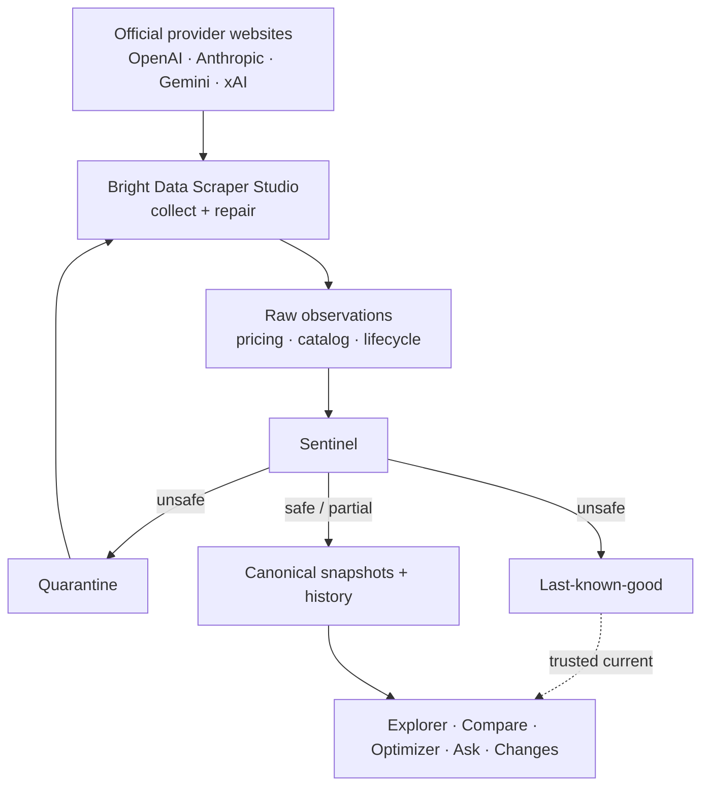
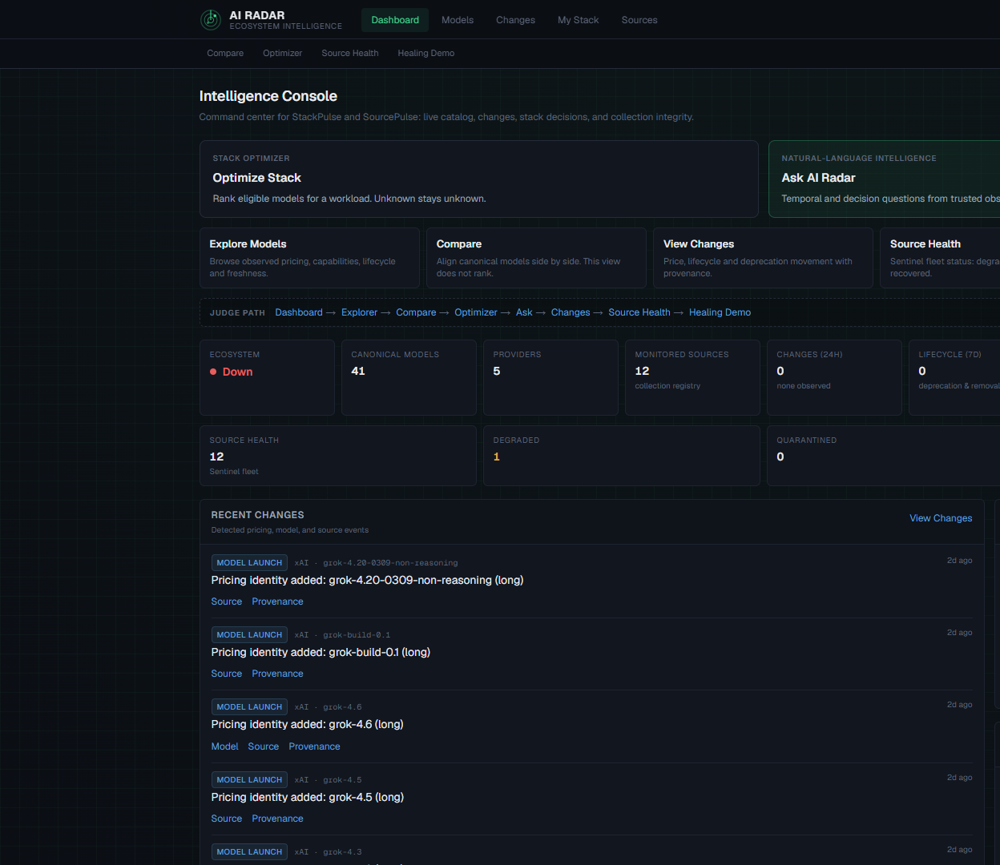
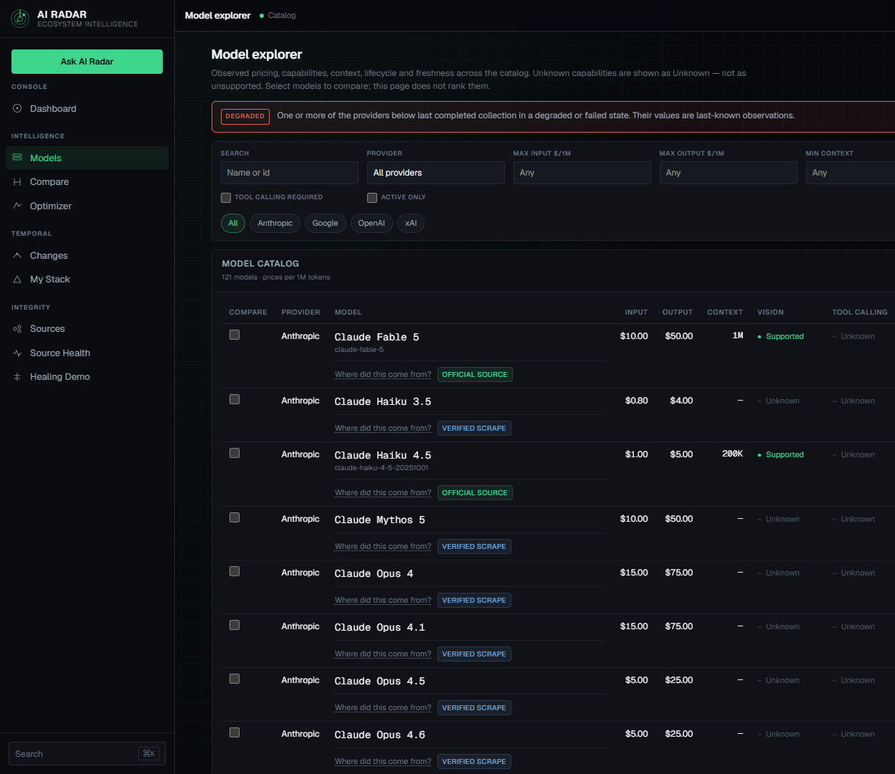
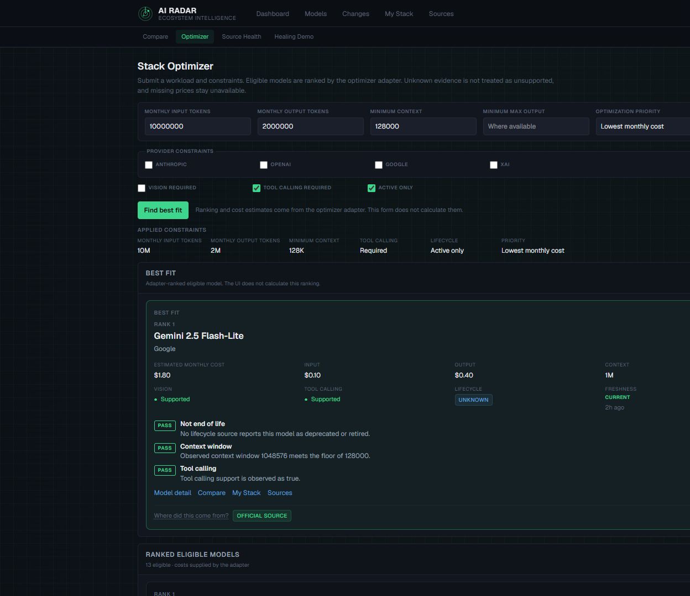
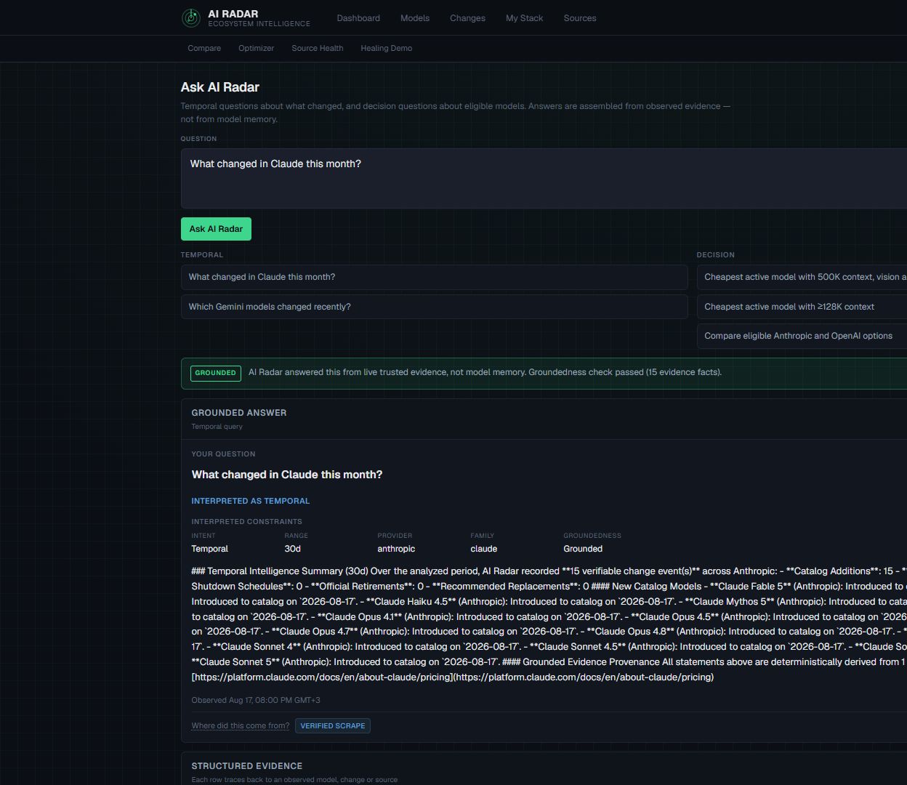
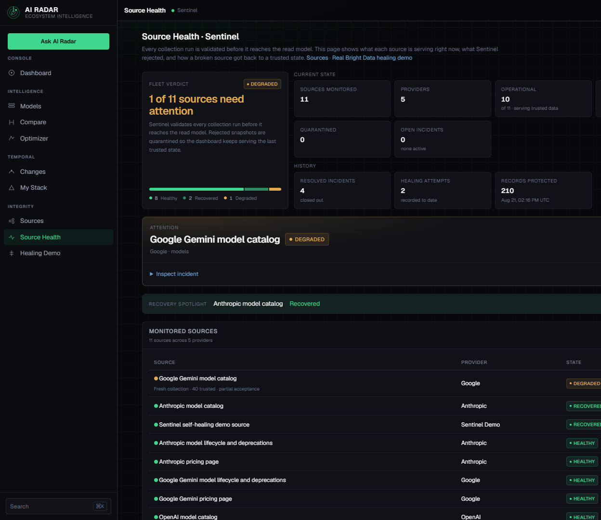
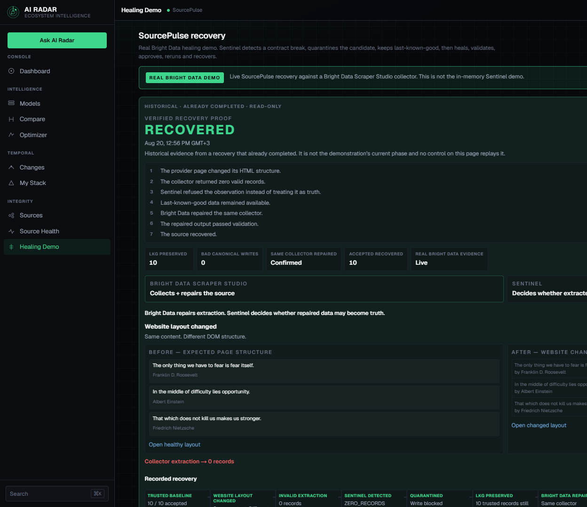

# AI Radar

AI Radar turns changing AI-provider websites into trusted, auditable intelligence.

It monitors official public pages from **OpenAI**, **Anthropic**, **Google Gemini**, and **xAI** across three domains:

- **Pricing**
- **Model catalogs / capabilities**
- **Lifecycle / deprecations**

The important difference: a scraper result is an **observation**, not automatically the truth. Bright Data Scraper Studio collects the page. Sentinel decides whether that payload may enter canonical history. If extraction fails, last-known-good stays up and the bad run writes nothing.

**Live:** [https://ai-radar-orpin.vercel.app](https://ai-radar-orpin.vercel.app)
**GitHub:** [https://github.com/Mohamed-ahmed-2006/AI-radar](https://github.com/Mohamed-ahmed-2006/AI-radar)
**Demo video:** [https://youtu.be/gvW5WQxCS5o]

Built for the WeMakeDevs **Into the Scrape-Verse** hackathon.

---

## The problem

AI providers constantly change models, prices, context windows, capabilities, lifecycle notices, and the HTML around all of that.

Developers still make stack decisions from:

- docs they last opened weeks ago
- comparison sites that lag
- screenshots in Slack
- whatever a chatbot remembers from training
- ordinary scrapers that write whatever they extracted

The deeper failure is not “we needed another scraper.” It is mistaking a **broken extraction** for a **real ecosystem change**.

Example:

1. A pricing or catalog layout changes.
2. The scraper returns zero models.
3. A naive pipeline concludes the models disappeared, and writes that as history.

AI Radar exists to stop that class of failure. Missing or invalid collector output is refused. Canonical history is not rewritten from a collapsed page.

---

## How AI Radar works

```
Official provider websites
        ↓
Bright Data Scraper Studio
        ↓
Raw observations
        ↓
Source contracts
        ↓
Sentinel
Validate / quarantine / last-known-good
        ↓
Canonical snapshots + history
        ↓
Changes / Explorer / Compare / Optimizer / Ask
```

**Bright Data** is the collection and repair plane: dedicated Scraper Studio collectors, dataset polling, and the same-collector refactor used when a layout breaks.

**Sentinel** is the trust and admission plane: structural and semantic validation, quarantine, partial acceptance where appropriate, last-known-good, incidents, and healing validation.

Nothing in the Next.js app scrapes provider pages itself. If `BRIGHTDATA_API_KEY` is missing, collection does not run.



---

## Bright Data Scraper Studio

Collection is not a side script. Every production source is a dedicated Scraper Studio collector.

AI Radar:

1. Triggers the Studio collector (`POST /dca/trigger`)
2. Polls the resulting dataset
3. Parses structured output
4. Validates it against a provider-specific contract
5. Hands the observation to Sentinel, which decides whether it may enter canonical history

### Production collectors

Ten fleet collectors, from `lib/orchestration/registry.ts` and the committed collector defaults:

| Provider | Domain | Source | Collector |
| --- | --- | --- | --- |
| OpenAI | Pricing | [developers.openai.com pricing](https://developers.openai.com/api/docs/pricing) | `c_msx3bqlyjtv2qustx` |
| Anthropic | Pricing | [platform.claude.com pricing](https://platform.claude.com/docs/en/about-claude/pricing) | `c_msxbuggp1czbtysx06` |
| Google Gemini | Pricing | [ai.google.dev Gemini pricing](https://ai.google.dev/gemini-api/docs/pricing) | `c_msxdkx5424fwc069z7` |
| xAI | Pricing | [docs.x.ai pricing](https://docs.x.ai/developers/pricing) | `c_msxf12ec1vq9w3d0r1` |
| Anthropic | Lifecycle | [Claude model deprecations](https://platform.claude.com/docs/en/about-claude/model-deprecations) | `c_msxj0fk3153bu9oz7l` |
| Google Gemini | Lifecycle | [Gemini deprecations](https://ai.google.dev/gemini-api/docs/deprecations) | `c_msxqpelk2cpxz8r386` |
| OpenAI | Catalog | [OpenAI models docs](https://developers.openai.com/api/docs/models) | `c_msz67jyrmiom6mbvn` |
| Anthropic | Catalog | [Claude models overview](https://platform.claude.com/docs/en/about-claude/models/overview) | `c_msz68u3ovithdetgu` |
| Google Gemini | Catalog | [Gemini models docs](https://ai.google.dev/gemini-api/docs/models) | `c_msz708an1gawux0njo` |
| xAI | Catalog | [xAI models docs](https://docs.x.ai/developers/models) | `c_msz6ahaofpm2d9j73` |

OpenAI and xAI do not currently have dedicated lifecycle collectors. Lifecycle changes are only admitted from authoritative lifecycle sources (Anthropic and Gemini deprecation pages). A model vanishing from a pricing table is not treated as a retirement.

There is also an **isolated demo collector** (`BRIGHTDATA_DEMO_COLLECTOR_ID`) used only for the SourcePulse recovery proof. It is not one of the ten fleet sources, and the harness refuses to run rather than borrowing a production collector.

### What happens when scraping breaks

```
broken layout
  → invalid extraction
  → Sentinel ZERO_RECORDS
  → quarantine
  → zero bad canonical writes
  → last-known-good preserved
  → Bright Data refactors the SAME dedicated demo collector
  → preview
  → validation
  → approval
  → rerun
  → RECOVERED
```

Production has already completed that path. The live app includes a **read-only historical Recovery Proof Replay** at [`/demo/healing`](https://ai-radar-orpin.vercel.app/demo/healing). Clicking **Replay proof** animates evidence that is already in the database. It does **not** trigger Bright Data again.

---

## SourcePulse / Sentinel

SourcePulse is the reliability and data-contract subsystem under AI Radar. Sentinel is the gate between a collector payload and canonical persistence.

What it actually does:

- **Structural validation** — records must match the source contract (Zod).
- **Semantic validation** — collapsed counts, illegal enums, missing token limits, duplicate identities, and similar invariants.
- **Quarantine** — refused payloads are stored as incidents, not as prices or capabilities.
- **Partial acceptance** — trusted records can be admitted while contradictory ones are refused. The source is then **DEGRADED**, not silently marked Healthy.
- **Last-known-good** — the last trusted snapshot remains the current evidence while a source is broken.
- **Incidents** — open, healing, resolved. The UI cannot mark a source healthy.
- **Healing validation** — a Bright Data refactor candidate re-enters the same gate. Recovery is earned by a successful admitted run.
- **Provenance** — admitted values keep source URL, collector, observation time, run, and snapshot identity.

Invariant: a missing model on a **pricing** page never automatically means the model was retired. Lifecycle changes only come from authoritative lifecycle sources.

Three-state honesty:

- **Unknown ≠ Unsupported**
- **Unknown ≠ zero**
- **Unavailable ≠ zero**

If nobody published a capability, the product says Unknown. It does not invent “no.”

---

## How to use the application

Production: [https://ai-radar-orpin.vercel.app](https://ai-radar-orpin.vercel.app)

### Dashboard

The Intelligence Console. Current ecosystem and fleet overview: models with canonical pricing, monitored sources, 24h changes, source health, recent events, and the judge path through the rest of the product.

### Model Explorer

[`/models`](https://ai-radar-orpin.vercel.app/models) — browse and filter observed models by provider, price, context, lifecycle, vision, tool calling, and active-only. Each row links provenance (**Official source** vs **Verified scrape**). **Quick View** opens a drawer with the same facts without leaving the table. This page explores; it does not rank.

### Model Detail

[`/models/[id]`](https://ai-radar-orpin.vercel.app/models) — one model’s pricing, context, max output, capabilities, modalities, lifecycle, freshness, and evidence.

### Compare

[`/models/compare`](https://ai-radar-orpin.vercel.app/models/compare) — side-by-side aligned observations for selected canonical ids. Shareable via URL. Compare explains differences. It does **not** rank or name a winner.

### Stack Optimizer

[`/optimizer`](https://ai-radar-orpin.vercel.app/optimizer) — you provide workload constraints and monthly token volumes. Deterministic filtering plus pricing math ranks eligible models. Unknown evidence does not count as unsupported; missing prices stay unavailable.

Pricing semantics: **standard pricing** is the normal default. Long-context surcharge tiers remain available separately and are **not** selected merely because a model supports a large context window.

### Ask AI Radar

[`/ask`](https://ai-radar-orpin.vercel.app/ask) — natural language in, typed intent out, trusted database, deterministic executor, grounded explanation. Never model-memory facts.

Three current typed modes:

1. **Temporal**
   Example: “What changed in Claude this month?”
2. **Decision / workload**
   Example: “What is the cheapest active model with at least 128K context and tool calling?”
3. **Model Fact**
   Examples: “Does Claude Opus 5 support video input?” · “What is Claude Opus 5's context window?”

Fail-closed example:

> “What does GPT-6 cost?”
>
> No trusted observed entity or evidence → AI Radar refuses to invent the answer.

The planner never emits SQL and never contributes a dollar figure. Ungroundable text is stripped.

### Changes

[`/changes`](https://ai-radar-orpin.vercel.app/changes) — historical trusted intelligence feed: price, capability, and lifecycle events with provenance.

Inadmissible historical observations may remain in audit storage while being excluded from this trusted feed. Nothing is silently rewritten; the row can still be inspected, it just is not presented as intelligence.

### My Stack

[`/my-stack`](https://ai-radar-orpin.vercel.app/my-stack) — a browser-local watchlist for models you actually care about. It is stored in that browser only, over live evidence.

### Sources

[`/sources`](https://ai-radar-orpin.vercel.app/sources) — every monitored web source and its current state (ten fleet collectors plus the isolated healing-demo source).

### Source Detail

[`/sources/[id]`](https://ai-radar-orpin.vercel.app/sources) — runs, incidents, healing, observed vs trusted records, evidence, and provenance for one source.

### Source Health

[`/source-health`](https://ai-radar-orpin.vercel.app/source-health) — Sentinel fleet / control-room view.

Current truthful Gemini example: the catalog can be **DEGRADED** while still freshly collecting, because 40 of 41 records were trusted and one contradictory identity was refused. That is partial acceptance, not a broken scraper.

### Healing Demo / Recovery Proof

[`/demo/healing`](https://ai-radar-orpin.vercel.app/demo/healing)

Plain-language version of what already happened:

1. The page DOM changed.
2. Extraction failed (zero records).
3. Sentinel blocked the observation (`ZERO_RECORDS`).
4. Last-known-good stayed available.
5. Bright Data repaired **the same** dedicated collector.
6. The repaired candidate passed validation and approval.
7. A rerun was admitted. The source is **RECOVERED**.

The page’s historical proof is a **read-only replay**. It does not run Bright Data when you press replay. Operator-only controls for a new live demonstration sit separately and do not rewrite that proof.

---

## Real production proof

Things the frozen product has actually done — not projections:

- Production is live at [ai-radar-orpin.vercel.app](https://ai-radar-orpin.vercel.app)
- Ten production Scraper Studio collectors across four providers
- Real production ingestion on all ten fleet sources
- Real quarantine on a zero-record extraction
- Zero bad canonical writes during the recovery proof
- Last-known-good preserved (10 trusted demo records kept serving)
- Same-collector Bright Data refactor (confirmed in the proof)
- Real **RECOVERED** state on the isolated demo source
- Fail-closed grounded Ask (unobserved models such as GPT-6 are refused)
- Real partial acceptance / contradiction handling on the Gemini catalog

No invented benchmark percentages.

---

## Architecture

```mermaid
flowchart LR
  subgraph Schedule["Scheduler"]
    GA["GitHub Actions<br/>hourly workflow"]
    CRON["POST /api/cron/collect<br/>protected"]
  end

  subgraph Fleet["Orchestration"]
    CAD["Cadence gates<br/>pricing 6h · catalog/lifecycle 12h"]
    LEASE["Per-source lease<br/>no overlap"]
  end

  subgraph Collect["Bright Data"]
    ST["Scraper Studio collectors"]
    DCA["Trigger · poll · refactor"]
  end

  subgraph Trust["Sentinel"]
    GATE["Contract + health vs LKG"]
  end

  subgraph Store["Supabase / PostgreSQL"]
    SNAP["Snapshots · history · change events"]
  end

  subgraph App["Next.js on Vercel"]
    SURFACES["Dashboard · Explorer · Optimizer · Ask · Health"]
  end

  GA --> CRON
  CRON --> CAD
  CAD --> LEASE
  LEASE --> ST
  ST --> DCA
  DCA --> GATE
  GATE --> SNAP
  SNAP --> SURFACES
```



The scheduler is **GitHub Actions**, not Vercel Cron. Hobby-plan Vercel Cron cannot tick hourly, so `.github/workflows/collect.yml` calls the protected `/api/cron/collect` route every hour. That tick is a heartbeat. Each source still runs only when its own cadence has elapsed:

| Family | Default cadence |
| --- | --- |
| Pricing | 6 hours |
| Lifecycle | 12 hours |
| Catalog | 12 hours |

Sources are isolated: one source failing does not stop the rest of the fleet. A lease prevents overlapping runs of the same source. Duplicate scheduler deliveries in the same tick window are no-ops.

More detail: [`docs/architecture.md`](docs/architecture.md), [`docs/collection-orchestration.md`](docs/collection-orchestration.md), [`docs/brightdata-ingestion.md`](docs/brightdata-ingestion.md).

---

## Tech stack

Verified from `package.json` and the repo, not a wish list:

| Layer | What is actually used |
| --- | --- |
| App | Next.js 16, React 19, TypeScript |
| Styling | Tailwind CSS 4, custom console CSS, Geist / Geist Mono |
| Data | Supabase (PostgreSQL), `@supabase/ssr` + `@supabase/supabase-js` |
| Contracts | Zod |
| Collection | Bright Data Scraper Studio / DCA API |
| Hosting | Vercel |
| Scheduler | GitHub Actions (`collect.yml`) |

There is no extra motion library and no unused analytics/ORM stack in the product.

---

## Provenance / trust

Two badges appear throughout the product. They are not the same thing:

| Badge | Meaning |
| --- | --- |
| **Official source** | Read directly from the provider’s own published page (authoritative domain such as lifecycle or catalog). |
| **Verified scrape** | Scraped and validated against the source contract before acceptance. |

A successful scrape is still an observation. Sentinel has to admit it before it becomes trusted history. Model facts in Explorer, Optimizer, Ask, and Changes link back to source evidence (page, collector, observation time, run, snapshot). The product does not ask you to trust a number with no trail.

---

## Current honest degradation example

The Gemini catalog may show **DEGRADED** while collection is still fresh.

Google currently publishes a contradictory Lyria identity. AI Radar:

- admits the trusted records
- rejects the contradictory one
- does **not** force the source to Healthy
- does **not** invent a new identity to make the collision disappear

That is the system working. It is not a dead collector.

---

## Setup / development

```bash
git clone https://github.com/Mohamed-ahmed-2006/AI-radar.git
cd AI-radar
npm install
cp .env.example .env.local
# fill required names from the table below — values stay in your environment
npm run check:env
npx supabase db push   # against your project; see docs/production-readiness.md
npm run dev
```

Open [http://localhost:3000](http://localhost:3000).

```bash
npm test
npm run typecheck
npm run lint
npm run build
npm run check:env    # prints names and reasons only, never values
```

### Environment variable names

Values are never documented here. `npm run check:env` prints names and reasons only.

**Required**

- `NEXT_PUBLIC_SUPABASE_URL`
- `NEXT_PUBLIC_SUPABASE_PUBLISHABLE_KEY` (or `NEXT_PUBLIC_SUPABASE_ANON_KEY`)
- `SUPABASE_SECRET_KEY` (or `SUPABASE_SERVICE_ROLE_KEY`)
- `AI_RADAR_INGEST_SECRET`
- `CRON_SECRET`
- `BRIGHTDATA_API_KEY`

**Recommended**

- `AI_RADAR_OPERATOR_KEY`
- `BRIGHTDATA_DEMO_COLLECTOR_ID`

**Optional collector / cadence overrides** — see `.env.example` (`BRIGHTDATA_*_COLLECTOR_ID`, `*_SOURCE_URL`, `AI_RADAR_COLLECTION_*`, `AI_RADAR_SOURCE_*`).

**Must remain unset in production**

- `SENTINEL_DEMO_MODE`
- `AI_RADAR_DEMO_EVIDENCE`
- `AI_RADAR_HEALING_DEMO_OPEN_CONTROLS`

Ingest and cron routes fail closed without secrets. Healing-demo mutating actions need the operator session (`POST /api/operator/session`).

---

## Security

This is an intelligence console, not a security product. The deployment posture is still fail-closed:

- Ingestion and orchestration mutations require `AI_RADAR_INGEST_SECRET` / `CRON_SECRET`
- Healing mutations are operator-only (signed HttpOnly session)
- Service-role keys stay server-side; the browser bundle uses the anon/publishable key under RLS
- The in-memory Sentinel simulator and fabricated Ask corpus are disabled in production

---

## AI-use disclosure

AI coding assistants (Cursor, Claude, Codex, and related agents) were used during development for implementation, tests, and documentation. Humans directed product scope, contracts, and the freeze.

Runtime Ask is not that. A question is compiled into a typed plan, then answered from collected evidence by deterministic executors (change feed, explorer, optimizer, model-fact lookup). Assistant memory is not the product database.

Full statement: [`docs/ai-use-disclosure.md`](docs/ai-use-disclosure.md).

---

## Hackathon alignment

Into the Scrape-Verse, mapped to the six judging areas with what the repo actually ships:

| Axis | Evidence |
| --- | --- |
| **Potential Impact** | Official AI-provider pages become an auditable history of prices, capabilities, and lifecycle — so a layout break cannot be mistaken for models disappearing. |
| **Creativity & Innovation** | Scraper output is an observation. Natural language is compiled into a typed intent. Unknown is a first-class state, not a synonym for false. |
| **Technical Excellence** | Ten contracted collectors, Zod gates, Sentinel before the first canonical write, leases, source isolation, RLS reads, server-only writes. |
| **Use of Scraper Studio** | Collection **is** Studio (trigger, poll, parse). Healing **is** Studio (refactor the same dedicated collector, preview, validate, approve, rerun). The Next.js app does not scrape. |
| **Reliability & Self-Healing** | ZERO_RECORDS → quarantine → zero bad writes → LKG preserved → same-collector repair → RECOVERED. Partial acceptance keeps Gemini honest instead of fake-healthy. |
| **Presentation** | Live app, judge path, read-only Recovery Proof Replay, grounded Ask, Source Health that shows degradation without calling it a broken scraper. |

Judge walkthrough: [`docs/demo-script.md`](docs/demo-script.md).
Submission notes: [`docs/submission.md`](docs/submission.md).

---

## Screenshots

From current production. Details: [`docs/screenshots/README.md`](docs/screenshots/README.md).

**Dashboard**



**Model Explorer**



**Stack Optimizer**



**Ask AI Radar**



**Source Health**



**Recovery Proof**



---

## Repository status

This repository is **public**.

No `LICENSE` file is present. Do not assume an open-source license unless one is added later.
