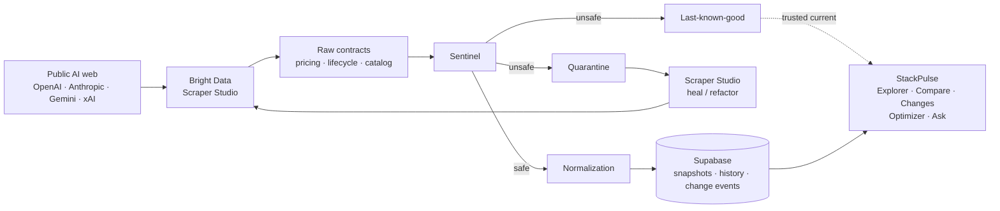

# AI Radar / StackPulse

**powered by SourcePulse**

The changing AI web → **Bright Data Scraper Studio** → contracts → Sentinel validation → trusted history → decision intelligence.

AI Radar is a live intelligence console for the AI model ecosystem. It does not scrape the public web with ad-hoc scripts. It collects through **Bright Data Scraper Studio**, admits only payloads that satisfy a contract, and answers questions from that trusted history — never from model memory.

Production: [https://ai-radar-orpin.vercel.app](https://ai-radar-orpin.vercel.app)

All ten configured fleet sources ingest live through Bright Data Scraper Studio. The hourly scheduler is operational. An isolated Bright Data healing proof completed through **RECOVERED**: last-known-good was preserved, and the refused run wrote zero canonical rows.

---

## Problem

AI infrastructure pages change constantly: prices move, models launch or retire, context windows and capabilities are rewritten, and HTML layouts break collectors. Teams still make stack decisions from screenshots, stale docs, or a chatbot's pretrained guesses.

The failure mode is not "we needed another scraper." It is **untrusted observation**: a broken extraction written as a price change, an unknown capability treated as unsupported, or a healing job declared recovered because a demo said so.

## Product

**StackPulse** is the decision surface: catalog, compare, change feed, My Stack, Stack Optimizer, and Ask AI Radar.

**SourcePulse** is the collection integrity surface: Bright Data collectors, contracts, Sentinel, last-known-good, quarantine, self-healing, Source Health, Source Detail, and the isolated recovery demo.

Judges should read the product as one pipeline. Bright Data is the collection and repair plane. Everything above it is only as trustworthy as what Sentinel admitted.

## Core thesis

```
Public AI web
    → Bright Data Scraper Studio collectors
    → raw contracts
    → Sentinel validation
    → quarantine / last-known-good / healing
    → normalization
    → Supabase snapshots, history, change events
    → Explorer / Compare / Changes / Optimizer / Ask
```

A website can change. The data contract must not silently change with it.

## Architecture

Bright Data is architectural, not decorative. Every pricing, lifecycle, and catalog source is a Scraper Studio collector. Ingestion cannot run without `BRIGHTDATA_API_KEY`. Healing is a real Scraper Studio refactor of an isolated collector, then the same Sentinel gate again.



A fuller diagram lives in [`docs/architecture.md`](docs/architecture.md). Collection orchestration is in [`docs/collection-orchestration.md`](docs/collection-orchestration.md).

### Production shape

| Layer | Implementation |
| --- | --- |
| App | Next.js on Vercel ([ai-radar-orpin.vercel.app](https://ai-radar-orpin.vercel.app)) |
| Reads | Supabase anon client + RLS |
| Writes | Server-only service role during ingestion |
| Collection | Vercel Cron → `/api/cron/collect` (hourly heartbeat; per-source cadence) |
| Collectors | Bright Data Scraper Studio (10 configured sources) |
| Integrity | Sentinel gate inside every pipeline, before the first canonical write |
| Operator demo | Isolated collector + signed HttpOnly session |

## Providers and collectors

Configured fleet (`lib/orchestration/registry.ts`):

| Source | Kind | Default public page |
| --- | --- | --- |
| OpenAI pricing | pricing | developers.openai.com pricing |
| Anthropic pricing | pricing | platform.claude.com pricing |
| Gemini pricing | pricing | ai.google.dev Gemini pricing |
| xAI pricing | pricing | docs.x.ai pricing |
| Anthropic lifecycle | lifecycle | Claude model deprecations |
| Gemini lifecycle | lifecycle | Gemini deprecations |
| OpenAI catalog | catalog | OpenAI models docs |
| Anthropic catalog | catalog | Claude models overview |
| Gemini catalog | catalog | Gemini models docs |
| xAI catalog | catalog | xAI models docs |

Sanitized collector output shapes: [`docs/examples/`](docs/examples/).

## Bright Data integration

Server-side adapter (`lib/brightdata`):

1. Trigger a Scraper Studio collector (`POST /dca/trigger`).
2. Poll the dataset until records arrive.
3. Parse against the domain contract (Zod).
4. Record run metadata (collector id, run id, timing, status).

Healing uses the same account and API: Sentinel observations drive a **real refactor job**. The candidate is previewed, validated with the same contract, approved only if it passed, then re-run through the same gate. Recovery is earned by a successful run, not assigned by the UI.

The isolated recovery demo has its own `BRIGHTDATA_DEMO_COLLECTOR_ID`. Unset, the demo reports **unavailable** and refuses to run rather than borrowing a production collector.

## SourcePulse / Sentinel

Sentinel sits **between** the collector and canonical persistence (`lib/sentinel/gate.ts`):

1. Load last-known-good for the source.
2. Validate the raw payload against the source contract and evaluate health.
3. Unsafe → open an incident, isolate the payload in quarantine, fail the run, throw. **Zero canonical rows.**
4. Safe → persist models, snapshots, change events; resolve an open incident if the source recovered.

There is no path that persists a quarantined collection. Healing never bypasses the gate: a repaired candidate re-enters the same pipeline.

### Last-known-good

The last trusted snapshot remains the current evidence while a source is broken. The product keeps serving LKG instead of writing a bad extraction as history.

### Quarantine

Rejected payloads are stored as incidents, not as prices or capabilities. Source Health and Source Detail show what was refused and why.

### Self-healing

Bounded repair: request a Scraper Studio refactor from what Sentinel observed → preview → validate → approve only a passing candidate → re-run → recover only if the gate accepts the new payload.

The in-memory Sentinel simulator (`SENTINEL_DEMO_MODE=1`) is **not** healing. It is a local recording aid and must be unset in production.

The judge-facing page is `/demo/healing`. Production has completed a live Bright Data recovery through **RECOVERED** (LKG preserved; refused run wrote zero canonical rows). Source Health keeps that recovered timeline. After proof the demo page is left clean and ready — healthy last-known-good, no open incident — rather than restaging an expensive cycle. If Bright Data, the dedicated collector, or Supabase writes are missing, the page says **unavailable**. It does not show a successful recovery it did not earn.

## StackPulse surfaces

| Route | What it is |
| --- | --- |
| `/` | Dashboard — live ecosystem, provenance, command center |
| `/models` | Model Explorer — observed pricing, capabilities, lifecycle, freshness |
| `/models/[id]` | Model Detail — one canonical model and its evidence |
| `/models/compare` | Compare — side by side; this view does not rank |
| `/changes` | Change Feed — price, lifecycle, capability events with provenance |
| `/my-stack` | My Stack — browser-local watchlist over live evidence |
| `/optimizer` | Stack Optimizer — workload ranking from observed prices and constraints |
| `/ask` | Ask AI Radar — temporal and decision questions from trusted evidence |
| `/sources` | Source registry |
| `/sources/[id]` | Source Detail — runs, incidents, healing, transformations |
| `/source-health` | Sentinel fleet health |
| `/demo/healing` | Isolated Bright Data recovery demo |

Unknown capabilities render as **Unknown**, never as unsupported. Missing prices stay unavailable. Empty live data is empty, not a fixture.

### Natural-language intelligence

Ask compiles English into a typed plan (`lib/ask`), then runs engines that already own the domain:

- **Temporal** — "What changed in Claude this month?" reads the change feed. No events → it says so.
- **Model selection / workload** — cheapest eligible model, vision + tools, compare providers. Ranking and arithmetic come from the optimizer, not from a language model.

The planner never emits SQL and never contributes a fact. Ungroundable text is stripped. `?demo=true` cannot serve the fabricated corpus unless `AI_RADAR_DEMO_EVIDENCE=1` is set server-side (forbidden in production).

### Provenance

Every trusted value can be traced to provider, source URL, collector, observation time, collection run, and snapshot (`GET /api/provenance`, Source Detail). Ask and Optimizer attach the same provenance to answers.

## Setup

```bash
git clone <this-repo>
cd AI-Radar
npm install
cp .env.example .env.local
# fill required names from the table below — values stay in your environment
npm run check:env
npx supabase db push   # against your project; see docs/production-readiness.md
npm run dev
```

Open [http://localhost:3000](http://localhost:3000).

### Environment variable names

Values are never documented here. `npm run check:env` prints names and reasons only.

**Required**

- `NEXT_PUBLIC_SUPABASE_URL`
- `NEXT_PUBLIC_SUPABASE_PUBLISHABLE_KEY` (or `NEXT_PUBLIC_SUPABASE_ANON_KEY`)
- `SUPABASE_SECRET_KEY` (or `SUPABASE_SERVICE_ROLE_KEY`)
- `AI_RADAR_INGEST_SECRET`
- `CRON_SECRET`
- `BRIGHTDATA_API_KEY`

**Recommended**

- `AI_RADAR_OPERATOR_KEY`
- `BRIGHTDATA_DEMO_COLLECTOR_ID`

**Optional collector / cadence overrides** — see `.env.example` (`BRIGHTDATA_*_COLLECTOR_ID`, `*_SOURCE_URL`, `AI_RADAR_COLLECTION_*`, `AI_RADAR_SOURCE_*`).

**Must be unset in production**

- `SENTINEL_DEMO_MODE`
- `AI_RADAR_DEMO_EVIDENCE`
- `AI_RADAR_HEALING_DEMO_OPEN_CONTROLS`

## Running locally

```bash
npm run dev          # Next.js
npm test             # unit / rendering tests
npm run typecheck
npm run lint
npm run build
npm run check:env    # production contract, names only
```

Ingest and cron routes fail closed without secrets. Healing demo mutating actions need the operator session (`POST /api/operator/session`).

## AI-use disclosure

Development was AI-assisted (Cursor, Claude, Codex, and related coding agents) for implementation, tests, and documentation. Product behavior is determined by contracts, Sentinel, Bright Data collectors, and the checked-in tests — not by a model answering from memory at runtime.

Ask AI Radar interprets a question into a plan, then answers only from collected evidence.

Full statement: [`docs/ai-use-disclosure.md`](docs/ai-use-disclosure.md).

## Hackathon alignment

Built for a Bright Data Scraper Studio / SourcePulse brief:

- **Scraper Studio is the collection plane** — ten collectors, trigger/poll, contracts, run metadata.
- **Reliability** — Sentinel, quarantine, last-known-good, isolated failure, bounded retries.
- **Self-healing** — real refactor → preview → validate → approve → re-run; production earned **RECOVERED** on the isolated demo collector.
- **Decision intelligence** — Explorer, Compare, Optimizer, Ask, Change Feed, all provenance-backed.
- **Honest presentation** — fixtures and simulators are opt-in; production shows empty or unavailable rather than invented success.

Judging-axis copy: [`docs/submission.md`](docs/submission.md).
Judge walkthrough: [`docs/demo-script.md`](docs/demo-script.md).
Production contract: [`docs/production-readiness.md`](docs/production-readiness.md).

## License

Private hackathon submission unless otherwise stated.
