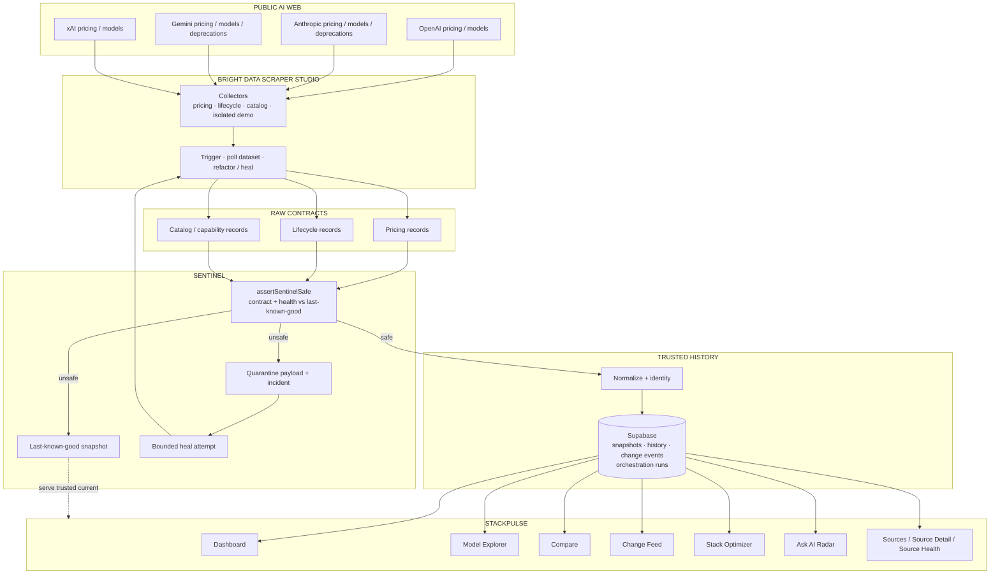

# Architecture

AI Radar / StackPulse, powered by SourcePulse. Bright Data Scraper Studio is the collection and repair plane.



## Why Bright Data is central

Without Scraper Studio there is no collection, no dataset to validate, and no refactor job for healing. Cron only decides *when* a source is due. Sentinel only decides *whether* a payload may become history. The product never scrapes provider pages from the Next.js runtime.

## Runtime path for one source

```
Vercel Cron  →  /api/cron/collect
             →  lease the source
             →  Bright Data collector
             →  raw contract
             →  Sentinel gate
                  unsafe → incident + quarantine, run failed, no canonical write
                  safe   → snapshots, change events, projections
             →  bounded heal if quarantined (candidate re-enters this path)
             →  report + release lease
```

Details: [`collection-orchestration.md`](collection-orchestration.md), [`brightdata-ingestion.md`](brightdata-ingestion.md), [`sentinel-healing-demo.md`](sentinel-healing-demo.md).
